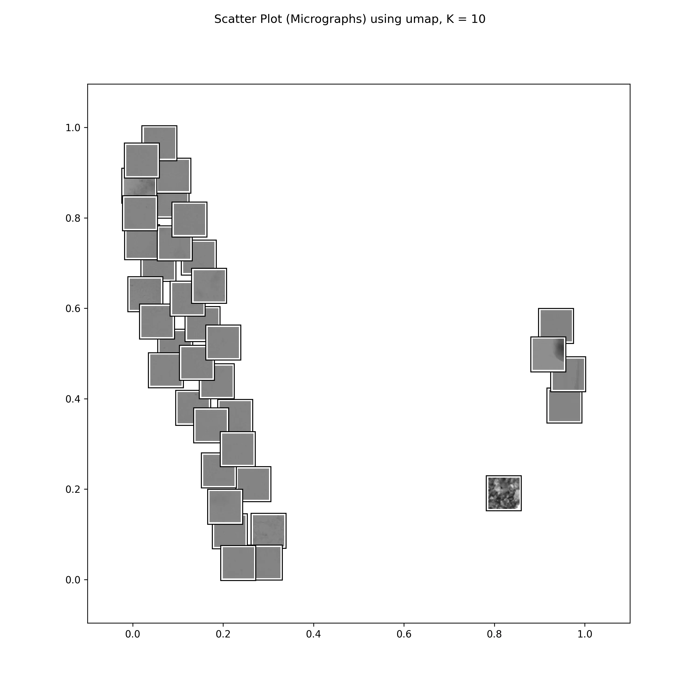
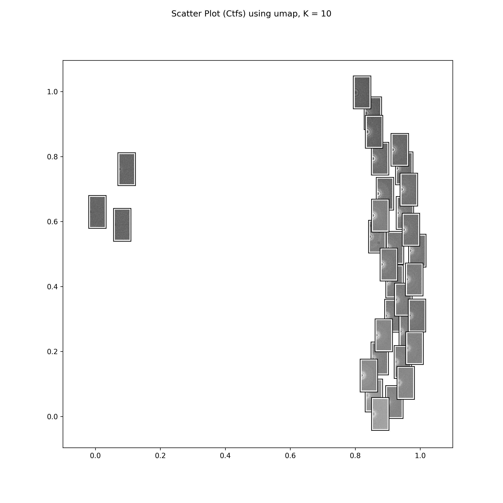
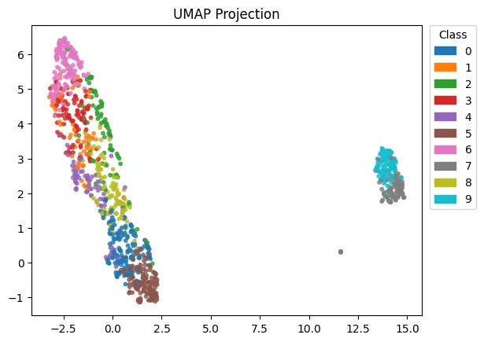

# 2D Embedding Generation and Visualization

Once the model has finished training, you can generate **static 2D visualizations** of learned feature vectors.  

These embeddings reveal structural patterns across your dataset — highlighting variations in ice type, presence of contamination, and support film coverage.

!!! tip

    The following steps can be applied to both **real-domain** and **Fourier-domain** models.

## 1. Generate 2D Embeddings for Real-Domain Images

Perform inference on the trained **real-domain** model:

```bash
prismpyp eval2d \
    --evaluate \
    --output-path output_dir/real \
    --metadata-path metadata \
    --feature-extractor-weights output_dir/real/checkpoints/model_best.pth.tar \
    --n-clusters 10 \
    --num-neighbors 10
```

!!! tip

    - Use the same model architecture and feature dimensions as in training.  
    - The embeddings will be saved to `output_dir/real/inference`.

## 2. Generate 2D Embeddings for Fourier-Domain Images

For Fourier-domain embeddings, include the `--use-fft` flag:

```bash
prismpyp eval2d \
    --evaluate \
    --output-path output_dir/fft \
    --metadata-path metadata \
    --feature-extractor-weights output_dir/fft/checkpoints/model_best.pth.tar \
    --n-clusters 10 \
    --num-neighbors 10 \
    --use-fft
```

!!! note

    This produces a 2D projection of the learned Fourier-domain embeddings, highlighting frequency-based variation across micrographs.

## 3. Project Precomputed Embeddings

If you have already generated embeddings, you can skip the inference step and directly project them to 2D:

```bash
prismpyp eval2d \
    --evaluate \
    --output-path output_dir/real \
    --metadata-path metadata \
    --embedding-path output_dir/real/inference/embeddings.pth \
    --feature-extractor-weights output_dir/real/checkpoints/model_best.pth.tar \
    --n-clusters 10 \
    --num-neighbors 10
```

Include the `--use-fft` flag if projecting **Fourier-domain** embeddings.

!!! warning 
    As in model training, if you are running multiple jobs at the same time (e.g., evaluating on real domain and Fourier domain images simultaneously), you will need to provide *different* `--dist-url` arguments for each job so that they do not try to access the same port.

## 4. Output Files

Each inference run creates an `inference/` directory inside your chosen output path, containing:

| File | Description |
|------|--------------|
| `embeddings.pth` | High-dimensional feature vectors for all images |
| `nearest_neighbors_x.webp` | Visualization of 8 nearest neighbors to a random point in embedding space |
| `scatter_plot_<method>.webp` | 2D scatter plot (PCA, UMAP, or t-SNE projection) |
| `thumbnail_plot_<method>_<ps or mg>.webp` | Same as above, but displays micrograph (`mg`) or power spectrum (`ps`) thumbnails instead of points |

The following visualizations are useful for spotting image-quality clusters or distinct artifact types.

### UMAP Distributions

The UMAP distributions for real and Fourier domain embeddings should look like this:  

=== "Real domain"

    

=== "Fourier domain"

    

### Nearest Neighbors

The nearest neighbors plots are useful for exploring similar images in the original dimensions (512) of the embedding space. The example image is plotted in the top left, and the 8-closest embedding vectors to the example vector are plotted in order of increasing distance (left --> right and top --> down) from the example image. They may look something like this:

=== "Real domain"
    The example image here shows a micrograph (right half) with high-quality features (no contaminants, support film, or crystalline ice) in the real domain. The nearest neighbors also look like the example image, and we can conclude that they share high-quality features in common.
    

=== "Fourier domain"
    The example image here shows a power spectrum (left half) with low-quality features (no Thon rings, likely acquired over an empty hole) in the Fourier domain. The nearest neighbors also show power spectra with similar low-quality features.
    

### Clustering

Lastly, you can see the clustering of data points *only* by looking at the scatter plot. Here, points are colored by class membership, as shown in in the legend on the right.

=== "Real domain"

    

=== "Fourier domain"

    

Your 2D embeddings are now ready for exploration and validation!