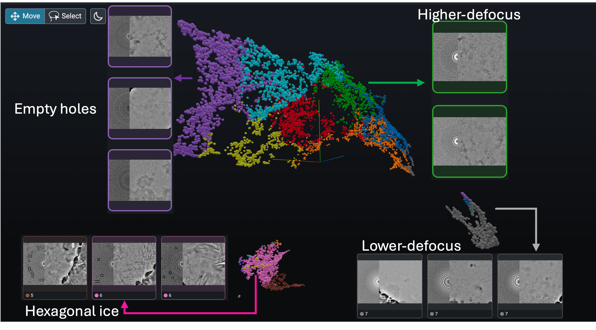

hide:
    - navigation

# 🔮 prismPYP: Power-spectrum and image domain learning for self-supervised micrograph evaluation

**prismPYP** implements a SimSiam-based self-supervised pipeline for classifying cryo-EM micrographs using both real-space and Fourier-space features.  

The goal is to automatically uncover image-quality categories such as vitreous ice, crystalline ice, contaminants, and support film entirely **without labels**.

The framework builds on a [PyTorch implementation of SimSiam](https://github.com/facebookresearch/simsiam), distributed under the [Attribution-NonCommercial 4.0 International](https://github.com/facebookresearch/simsiam/blob/main/LICENSE) license.

The software is developed and maintained by the [Bartesaghi Lab](http://cryoem.cs.duke.edu) at [Duke University](http://www.duke.edu) and released under the [BSD 3-Clause](https://github.com/nextpyp/prismpyp/blob/main/LICENSE) license.