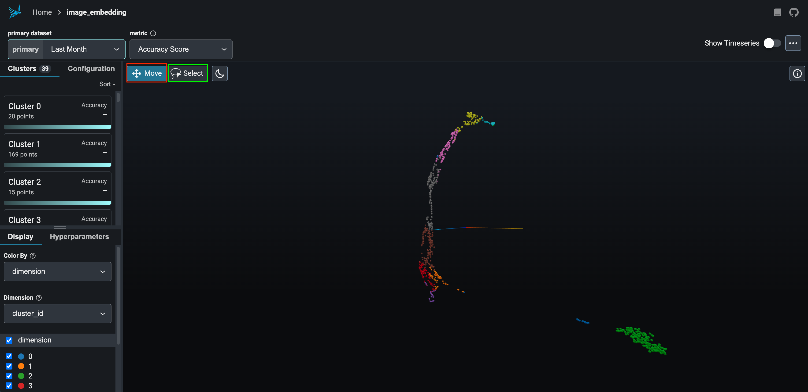

# Visualizing 3D Results in Phoenix 🐦‍🔥 

## 1. Prepare Real-Domain Visualization

These instructions assume inference results from **real-domain inputs**.

Copy output files to your local machine:

   ```bash
   cp output_dir/real/inference/data_for_export.parquet.zip real/
   cp output_dir/real/inference/zipped_thumbnail_images.tar.gz real/
   ```

Create a folder for the thumbnail images:

   ```bash
   mkdir -p real/thumbnail_images
   ```

Extract thumbnails:

   ```bash
   tar -xvzf zipped_thumbnail_images.tar.gz -C real/thumbnail_images
   ```

Start a local HTTP server to host thumbnails:

   ```bash
   cd real
   screen
   python -m http.server 5004
   ```

In another terminal, download and launch the visualizer:

   ```bash
   wget https://github.com/nextpyp/prismpyp/blob/main/scripts/visualizer.py

   python visualizer.py \
      real/data_for_export.parquet.zip \
      --port 5004 \
      --which-embedding umap
   ```

!!! warning

      Make sure that the ports used in steps 4 and 5 are identical.

When launched successfully, you’ll see output like:

```bash
🌍 To view the Phoenix app in your browser, visit http://localhost:54116/
📺 To view the Phoenix app in a notebook, run `px.active_session().view()`
📖 For more information on how to use Phoenix, check out https://docs.arize.com/phoenix
```

You can now access the interactive visualization at [http://localhost:54116/](http://localhost:54116/).

## 2. Visualize Fourier-Domain Results

You can repeat the same steps for Fourier-domain inputs.

Copy the output files

   ```bash
   cp output_dir/fft/inference/data_for_export.parquet.zip fft/
   cp output_dir/fft/inference/zipped_thumbnail_images.tar.gz fft/
   ```

Create a folder for the thumbnail images

   ```bash
   mkdir -p fft/thumbnail_images_dir
   ```

Extract thumbnails:

   ```bash
   tar -xvzf zipped_thumbnail_images.tar.gz -C fft/thumbnail_images_dir
   ```

Start an HTTP server (you can use `screen` if desired)

   ```bash
   cd fft
   screen
   python -m http.server 5004
   ```

Launch the visualization

   ```bash
   python visualizer.py \
      fft/data_for_export.parquet.zip \
      --port 5004 \
      --which-embedding umap
   ```

## Expected Results

When you first launch Phoenix, you will be greeted by a landing page like this:


Click on the `image_embeddings` link (boxed in red) to load the interactive visualization. 

The interactive visualization for this dataset may look as follows:

=== "Real domain"

    

=== "Fourier domain"

    

To navigate the embedding space, click on the `Move` box (boxed in red) and click and drag your mouse across the screen. When you're ready to make a selection to view/download points, click the `Select` box (boxed in green).

The `Select` box will allow you to view the micrograph and power spectra thumbnails for the selected subset of points. This may look as follows:

=== "Real domain"

    

=== "Fourier domain"

    

To download the selection as a `.parquet` file, click on the `Export` box (boxed in red).

## Lasso Selection and Output

For both domains, interactive **lasso selections** will be saved as downloadable `.parquet` files:

| Domain | Output File |
|---------|--------------|
| Real | `real/real_good_export.parquet` |
| Fourier | `fft/fft_good_export.parquet` |

These outputs contain the selected subset of high-quality micrographs and can be used for further filtering or downstream processing.