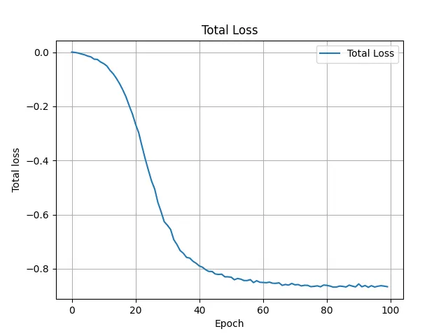
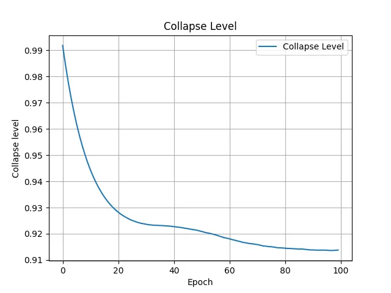

# Label-Free Feature Learning

This section describes how to train **SimSiam models** on both **real-domain** and **Fourier-domain**.

The goal is to learn domain-specific embeddings that capture image-quality features (e.g., vitreous ice, crystalline ice, contaminants, and support film) without using labels.

## 1. Download Pretrained Weights

Before training, download the pretrained **ResNet-50** backbone weights from the official SimSiam repository:

```bash
mkdir -p pretrained_weights
wget https://dl.fbaipublicfiles.com/simsiam/models/100ep/pretrain/checkpoint_0099.pth.tar -P pretrained_weights/
```

Using pretrained weights speeds up convergence and stabilizes representation learning.  

If you prefer to train from scratch, you can omit the `--resume` flag in the commands below.

## 2. Training on Real-Domain Images

Train the SimSiam model on **real-space micrograph images**:

```bash
prismpyp train \
  --output-path output_dir/real \
  --metadata-path metadata \
  --resume pretrained_weights/checkpoint_0099.pth.tar \
  --rank 0
```

!!! tip 

    You may adjust the `--batch-size` and `--workers` arguments based on GPU memory and available CPU cores. See [here](ref_train.md) for other options.

## 3. Training on Fourier-Domain Images

For **Fourier-space inputs**, we just add the `--use-fft` flag and change the output path:

```bash
prismpyp train \
  --output-path output_dir/fft \
  --metadata-path metadata \
  --resume pretrained_weights/checkpoint_0099.pth.tar \
  --use-fft
```

## 4. Notes on Checkpoints

If you’d rather start from scratch or use your own pretrained model, omit the `--resume` flag or point it to a different `.pth.tar` checkpoint.

During training, **per-batch loss** and **collapse level** are printed in the terminal. After training completes, the following outputs will be found under your specified `--output-path`:

| Output | Description |
|---------|--------------|
| `checkpoints/model_best.pth.tar` | Model with lowest total loss |
| `checkpoints/model_lowest_collapse.pth.tar` | Model with lowest collapse metric |
| `checkpoints/model_last.pth.tar` | Final epoch checkpoint |
| `total_loss.webp` | Plot showing total loss per epoch (lower is better) |
| `collapse_level.webp` | Plot showing collapse metric per epoch (higher is better) |
| `training_config.yaml` | Copy of training parameters used for reproducibility |

## 5. Diagnostic Outputs

=== "Model Loss"

    If training converges, the ```total_loss.webp``` plot should look something like this:
    

=== "Collapse Level"

    If the model successfully learned to extract meaningful semantics from the input image, the total collapse plot can plateau, decrease, but should not approach 0:
    

Your models are now trained and ready for embedding generation!