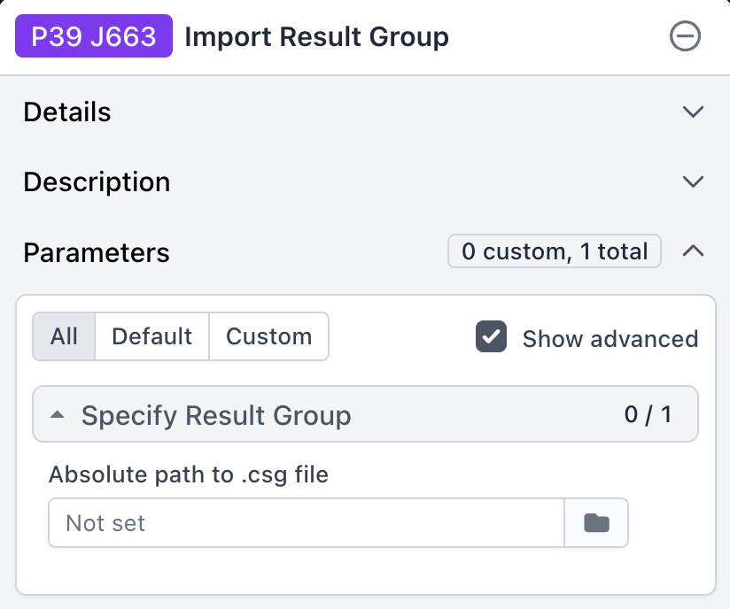

# Re-Uploading High-Quality Subsets to CryoSPARC

After obtaining the final subset of images with high-quality features in both the real and Fourier domains, we can make a new `.cs` file for uploading to cryoSPARC in order to perform subsequent processing.

We will use the outputs generated by the previous `intersect` command to help save some re-computation.

### Activate the Environment

```bash
conda activate prismpyp
```

### Create a New `.cs` File for the Subset

Run the following command to generate a new `.cs` file that can be re-imported to your cryoSPARC project:

```bash
prismpyp upload_cryosparc \
--output-folder intersection \
--link-type soft \
--cs-path /path/to/latest/job/file.cs
```

The choice of `--cs-path` depends on the last pre-processing job you ran in your cryoSPARC project before switching to prismPYP. For example, if you want to keep the pre-computed CTF parameters from a Manually Curate Exposures job (J4), then you would supply the exported `.cs` file from the Manually Curate Exposures job, like so:

```bash
prismpyp upload_cryosparc \
--output-folder intersection \
--link-type soft \
--cs-path /cryosparc/output/dir/exports/groups/J4_exposures_accepted/J4_exposures_accepted_exported.cs
```

### Output Files

The following output will be written to the `intersection/` directory:

| File | Description |
|------|--------------|
| `filtered.cs` | CryoSPARC metadata file containing the good subset of micrographs that are suitable for downstream processing. |


### Importing Results Back Into CryoSPARC

The `upload_cryosparc` command will produce a file `filtered.cs` that contains only the statistics for the micrographs in `intersection/files_in_common.txt`. You can then use the `filtered.cs` file in cryoSPARC by using a `Import Results Group` job:



This job takes the absolute path to a `.csg` file as input. See the cryoSPARC documentation [here](https://guide.cryosparc.com/processing-data/all-job-types-in-cryosparc/import/job-import-result-group) for more information.

In order to re-import this subset into cryoSPARC, you will need to do the following:

1. (Optional but highly recommended) Save a backup of the original `.cs` file:
   ```bash
   cp /cryosparc/output/dir/exports/groups/J4_exposures_accepted/J4_exposures_accepted_exported.cs \
      /cryosparc/output/dir/exports/groups/J4_exposures_accepted/J4_exposures_accepted_exported.cs.bak
   ```
2. Copy the output file from `intersection/filtered.cs` to your cryoSPARC project directory (e.g., `/cryosparc/output/dir`) *under the same file name as the original `.cs` file*:
   ```bash
    cp intersection/filtered.cs \
       /cryosparc/output/dir/exports/groups/J4_exposures_accepted/J4_exposures_accepted_exported.cs
   ```
3. Create an `Import Results Group` job in cryoSPARC and supply the `.csg` file associated with the Manually Curate Exposures job:
    `/cryosparc/output/dir/exports/groups/J4_exposures_accepted/J4_exposures_accepted_exported.csg`

4. Now, you can proceed with next steps in cryoSPARC.